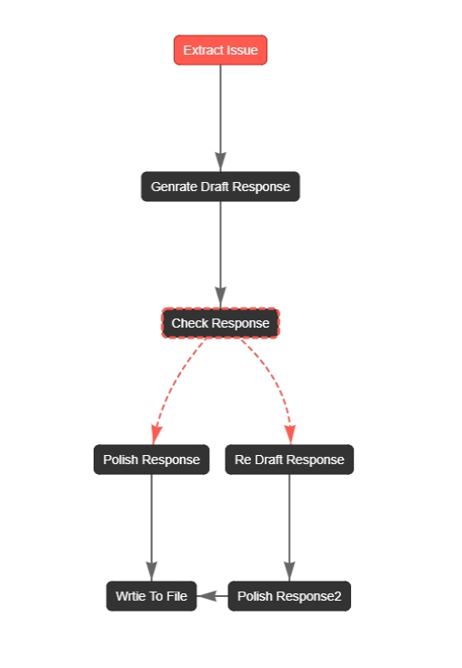
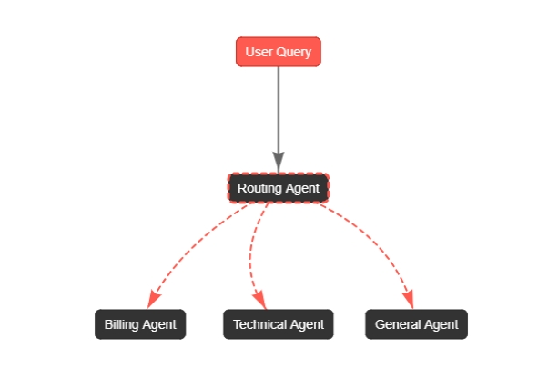

# AI Agent Implementation Project

This project implements various agent patterns and workflows using CrewAI, focusing on the patterns described in Anthropic's research paper ["Building Effective Agents"](https://www.anthropic.com/research/building-effective-agents).

## Project Overview

This project uses:
- **UV** for Python package management (a faster alternative to pip)
- **CrewAI** for implementing agent workflows using the CrewAI Flow class
- Implementation patterns from Anthropic's agent research

## Agent Patterns

Each pattern will be implemented in separate files to maintain clarity and modularity. The patterns we'll implement include:

### 1. Chain-of-Thought Prompting
   
   This flowchart illustrates the Chain of Thought implementation for customer support:
   - Extracts issue from customer email
   - Generates draft response
   - Checks for empathetic language
   - Re-drafts if necessary
   - Polishes final response
   - Writes to file

## 2. Routing Agents (Customer Support AI with Specialized Agents)

### Workflow Breakdown

. **User Query Input:** The system receives a customer's message.
. **Routing Agent:** A classification model determines the nature of the query.
. **Specialized Agents:** Based on the classification, the query is routed to one of the following specialized agents:
   - **Billing Agent**: Handles payment issues, invoices, refunds.
   - **Technical Support Agent**: Resolves product issues, troubleshooting.
   - **General Inquiry Agent**: Answers general questions, policies, FAQs.
. **Response Generation:** The selected agent processes the query and provides a response.

3. Tool Use
4. Planning and Decomposition
5. Memory and Note-Taking
6. Verification and Self-Correction
7. Learning from Feedback
8. Multi-Agent Collaboration

## Project Structure

Each pattern will have its own implementation file under the `src/patterns` directory:

## Contributing

Feel free to contribute by implementing additional patterns or improving existing implementations. Please follow the project's structure and add appropriate tests.

## References

- [Building Effective Agents (Anthropic Research)](https://www.anthropic.com/research/building-effective-agents)
- [CrewAI Documentation](https://github.com/joaomdmoura/crewAI)
- [UV Package Manager](https://github.com/astral-sh/uv)
